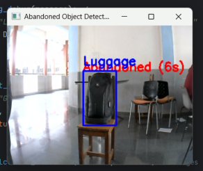

# 🎥 AlertVision - Abandoned Object Detection System

This project is a real-time video surveillance system that detects abandoned objects such as luggage or bags. It uses **YOLOv8** for object detection and **ResNet50** for person re-identification to intelligently track when an object is left unattended and whether the same person returns to claim it. The system is useful for improving safety and automation in high-security areas like airports, stations, and malls.

The logic includes distance calculation, re-identification, and timer mechanisms to make decisions dynamically.

---

## 🚀 Features

- 🎯 **Real-Time Object Detection** — Uses YOLOv8 to detect people and objects from video streams.
- 🧠 **Person Re-Identification** — ResNet50 helps verify if the same person returns to the object.
- 📏 **Proximity Check** — Calculates the distance between objects and persons to monitor interaction.
- ⏲️ **Abandonment Timer** — Starts a timer if no person is near an object; flags it as abandoned after a threshold.
- ♻️ **Dynamic Timer Reset** — Timer resets if the person comes back before time runs out.
- 📹 **Video Input Support** — Works with webcam or video file inputs.
- 📊 **Visual Results** — Annotated video frames for easy understanding of object status.

---

## 🛠️ Tech Stack

| Category         | Technologies Used                                       |
|------------------|----------------------------------------------------------|
| Object Detection | YOLOv8 (Ultralytics)                                     |
| Re-ID Model      | ResNet50 via Torchreid                                   |
| Programming Lang | Python                                                   |
| Libraries        | OpenCV, Torch, NumPy, Seaborn, Scikit-learn, Matplotlib |

---

## 📥 Model Downloads

✅ YOLOv8 (Trained Model)

You can use your own trained model, or download a sample YOLOv8n model from Ultralytics:

[Download Pretrained YOLOv8n Weights](https://github.com/ultralytics/ultralytics/releases)

✅ ResNet50 (TorchReID Pretrained)

We use OSNet (ResNet-like) model for person re-identification:

- TorchReID automatically downloads the pretrained weights from its model zoo.

- You don’t need to download manually.

Reference: [TorchReID Model Zoo](https://kaiyangzhou.github.io/deep-person-reid/MODEL_ZOO)

---

## 🧪 How It Works

- YOLOv8 detects all people and objects in each frame.

- A Euclidean distance check determines if any person is near an object.

- If no person is nearby, a timer starts.

- If the person returns, ResNet50 checks if it's the same one.

- The timer resets if matched, else the object is flagged as abandoned.

---

## 📸 Sample Output

Here’s a sample frame showing the detection and abandonment status:

---

## ✨ Completed Features

✅ Real-time person and object detection
✅ Re-identification using ResNet50
✅ Distance-based object monitoring
✅ Automatic abandonment flagging
✅ Reset mechanism for returning person
✅ Webcam and video file compatibility
✅ Visualization with bounding boxes and labels

---

## 🤝 Contributions

Pull requests are welcome! If you have suggestions or improvements, feel free to fork the repo and submit a PR. Open an issue for major changes or new ideas.

---

## 📜 License

This project is licensed under the MIT License — you're free to use and modify with attribution.

